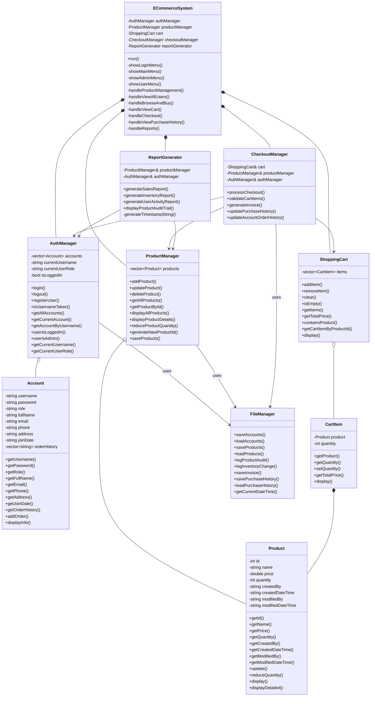

```mermaid
classDiagram
    %% Main System Class
    class ECommerceSystem {
        -AuthManager authManager
        -ProductManager productManager
        -ShoppingCart cart
        -CheckoutManager checkoutManager
        -ReportGenerator reportGenerator
        +run()
        -showLoginMenu()
        -showMainMenu()
        -showAdminMenu()
        -showUserMenu()
        -handleProductManagement()
        -handleViewAllUsers()
        -handleBrowseAndBuy()
        -handleViewCart()
        -handleCheckout()
        -handleViewPurchaseHistory()
        -handleReports()
    }

    %% User Account Classes
    class Account {
        -string username
        -string password
        -string role
        -string fullName
        -string email
        -string phone
        -string address
        -string joinDate
        -vector~string~ orderHistory
        +getUsername()
        +getPassword()
        +getRole()
        +getFullName()
        +getEmail()
        +getPhone()
        +getAddress()
        +getJoinDate()
        +getOrderHistory()
        +addOrder()
        +displayInfo()
    }

    class AuthManager {
        -vector~Account~ accounts
        -string currentUsername
        -string currentUserRole
        -bool isLoggedIn
        +login()
        +logout()
        +registerUser()
        +isUsernameTaken()
        +getAllAccounts()
        +getCurrentAccount()
        +getAccountByUsername()
        +userIsLoggedIn()
        +userIsAdmin()
        +getCurrentUsername()
        +getCurrentUserRole()
    }

    %% Product Related Classes
    class Product {
        -int id
        -string name
        -double price
        -int quantity
        -string createdBy
        -string createdDateTime
        -string modifiedBy
        -string modifiedDateTime
        +getId()
        +getName()
        +getPrice()
        +getQuantity()
        +getCreatedBy()
        +getCreatedDateTime()
        +getModifiedBy()
        +getModifiedDateTime()
        +update()
        +reduceQuantity()
        +display()
        +displayDetailed()
    }

    class ProductManager {
        -vector~Product~ products
        +addProduct()
        +updateProduct()
        +deleteProduct()
        +getAllProducts()
        +getProductById()
        +displayAllProducts()
        +displayProductDetails()
        +reduceProductQuantity()
        +generateNewProductId()
        +saveProducts()
    }

    %% Shopping Cart Classes
    class CartItem {
        -Product product
        -int quantity
        +getProduct()
        +getQuantity()
        +setQuantity()
        +getTotalPrice()
        +display()
    }

    class ShoppingCart {
        -vector~CartItem~ items
        +addItem()
        +removeItem()
        +clear()
        +isEmpty()
        +getItems()
        +getTotalPrice()
        +containsProduct()
        +getCartItemByProductId()
        +display()
    }

    %% Checkout Management
    class CheckoutManager {
        -ShoppingCart& cart
        -ProductManager& productManager
        -AuthManager& authManager
        +processCheckout()
        +validateCartItems()
        +generateInvoice()
        +updatePurchaseHistory()
        +updateAccountOrderHistory()
    }

    %% Report Generation
    class ReportGenerator {
        -ProductManager& productManager
        -AuthManager& authManager
        +generateSalesReport()
        +generateInventoryReport()
        +generateUserActivityReport()
        +displayProductAuditTrail()
        -generateTimestampString()
    }

    %% File Management
    class FileManager {
        +saveAccounts()
        +loadAccounts()
        +saveProducts()
        +loadProducts()
        +logProductAudit()
        +logInventoryChange()
        +saveInvoice()
        +savePurchaseHistory()
        +loadPurchaseHistory()
        +getCurrentDateTime()
    }

    %% Relationships
    ECommerceSystem *-- AuthManager
    ECommerceSystem *-- ProductManager
    ECommerceSystem *-- ShoppingCart
    ECommerceSystem *-- CheckoutManager
    ECommerceSystem *-- ReportGenerator
    
    AuthManager o-- Account
    ProductManager o-- Product
    ShoppingCart o-- CartItem
    CartItem *-- Product
    
    CheckoutManager --> ShoppingCart
    CheckoutManager --> ProductManager
    CheckoutManager --> AuthManager
    
    ReportGenerator --> ProductManager
    ReportGenerator --> AuthManager
    
    AuthManager --> FileManager : uses
    ProductManager --> FileManager : uses
    CheckoutManager --> FileManager : uses
```
