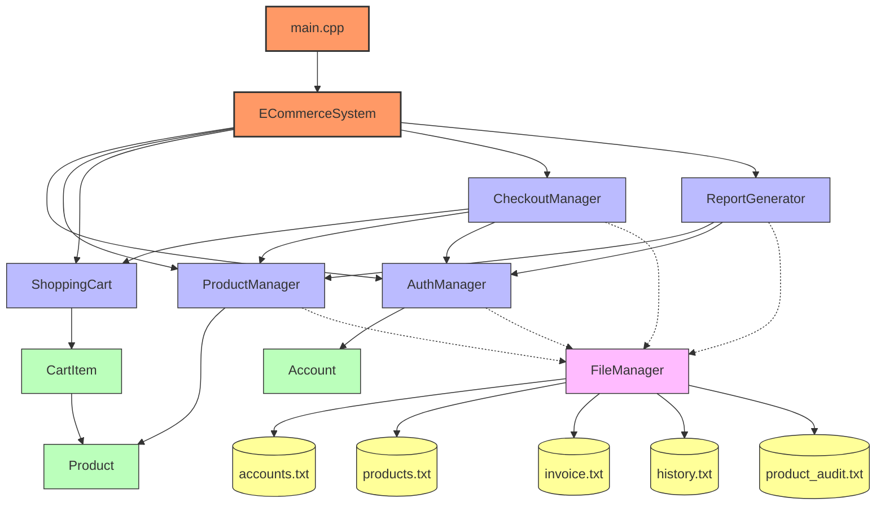

```mermaid
flowchart TB
    %% Main components
    main[main.cpp]
    ecommerce[ECommerceSystem]
    auth[AuthManager]
    product[ProductManager]
    cart[ShoppingCart]
    checkout[CheckoutManager]
    report[ReportGenerator]
    file[FileManager]

    %% Data models
    account[Account]
    productClass[Product]
    cartItem[CartItem]

    %% Files
    accountsFile[(accounts.txt)]
    productsFile[(products.txt)]
    invoiceFile[(invoice.txt)]
    historyFile[(history.txt)]
    auditFile[(product_audit.txt)]

    %% Connections - Control Flow
    main --> ecommerce
    ecommerce --> auth
    ecommerce --> product
    ecommerce --> cart
    ecommerce --> checkout
    ecommerce --> report

    %% Component relationships
    auth --> account
    product --> productClass
    cart --> cartItem
    cartItem --> productClass

    %% Service dependencies
    checkout --> cart
    checkout --> product
    checkout --> auth
    report --> product
    report --> auth

    %% File I/O operations
    file --> accountsFile
    file --> productsFile
    file --> invoiceFile
    file --> historyFile
    file --> auditFile
    
    auth -.-> file
    product -.-> file
    checkout -.-> file
    report -.-> file

    %% Style
    classDef main fill:#f96,stroke:#333,stroke-width:2px
    classDef manager fill:#bbf,stroke:#333,stroke-width:1px
    classDef model fill:#bfb,stroke:#333,stroke-width:1px
    classDef service fill:#fbf,stroke:#333,stroke-width:1px
    classDef storage fill:#ff9,stroke:#333,stroke-width:1px

    class main main
    class ecommerce main
    class auth,product,cart,checkout,report manager
    class account,productClass,cartItem model
    class file service
    class accountsFile,productsFile,invoiceFile,historyFile,auditFile storage
```
