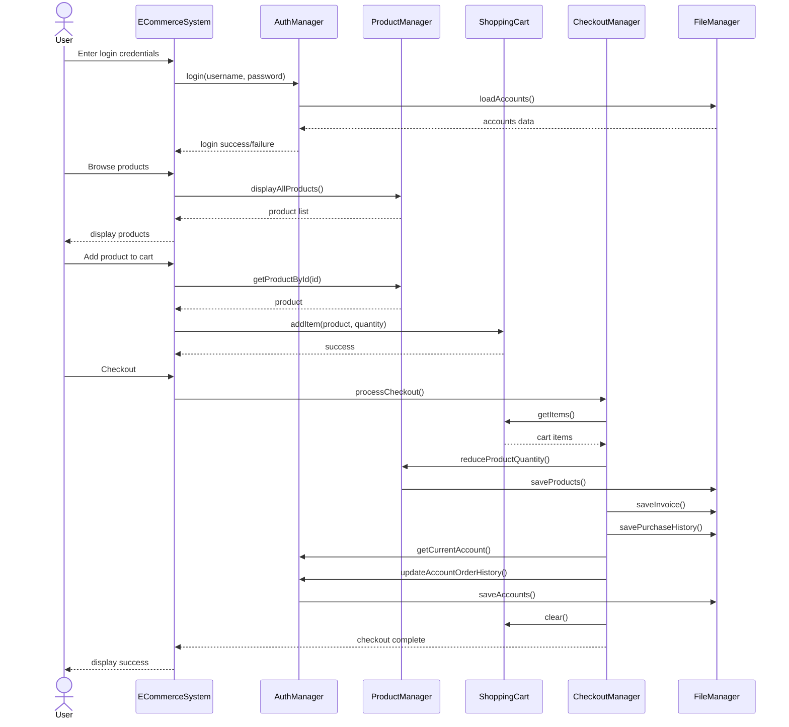

```mermaid
sequenceDiagram
    actor User
    participant UI as ECommerceSystem
    participant Auth as AuthManager
    participant Product as ProductManager
    participant Cart as ShoppingCart
    participant Checkout as CheckoutManager
    participant File as FileManager
    
    %% Login Flow
    User->>UI: Enter login credentials
    UI->>Auth: login(username, password)
    Auth->>File: loadAccounts()
    File-->>Auth: accounts data
    Auth-->>UI: login success/failure
    
    %% Browse Products Flow
    User->>UI: Browse products
    UI->>Product: displayAllProducts()
    Product-->>UI: product list
    UI-->>User: display products
    
    %% Add to Cart Flow
    User->>UI: Add product to cart
    UI->>Product: getProductById(id)
    Product-->>UI: product
    UI->>Cart: addItem(product, quantity)
    Cart-->>UI: success
    
    %% Checkout Flow
    User->>UI: Checkout
    UI->>Checkout: processCheckout()
    Checkout->>Cart: getItems()
    Cart-->>Checkout: cart items
    Checkout->>Product: reduceProductQuantity()
    Product->>File: saveProducts()
    Checkout->>File: saveInvoice()
    Checkout->>File: savePurchaseHistory()
    Checkout->>Auth: getCurrentAccount()
    Checkout->>Auth: updateAccountOrderHistory()
    Auth->>File: saveAccounts()
    Checkout->>Cart: clear()
    Checkout-->>UI: checkout complete
    UI-->>User: display success
```
